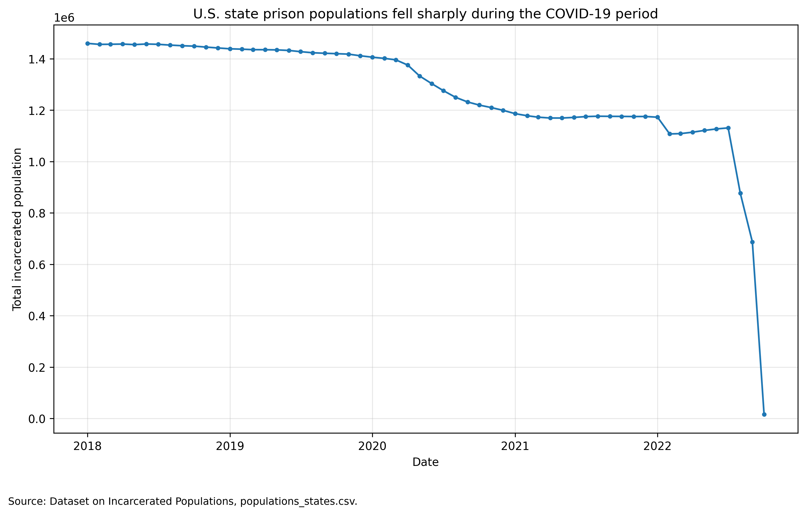
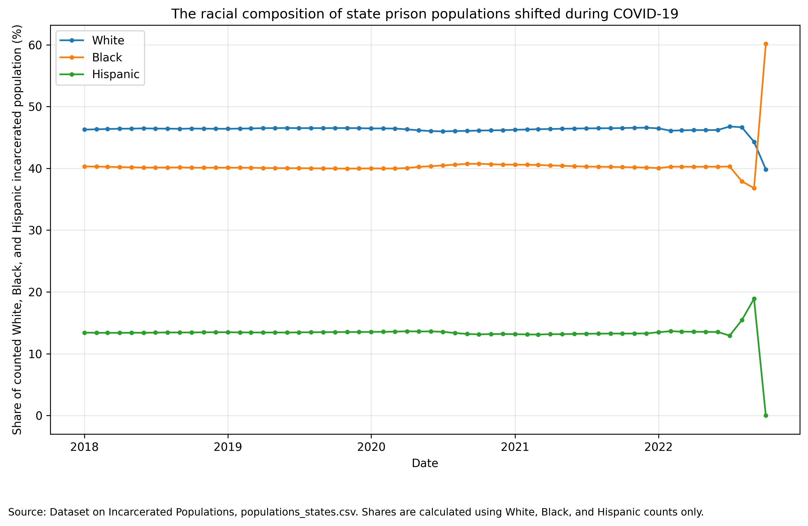

# COVID-era prison population drops did not affect all racial groups equally

Prison populations across the United States sharply declined during the first year of the COVID-19 pandemic. At first, this decline seems like a broader example of decarceration. But a decline in the total number of incarcerated people does not automatically mean that every group was equally affected. 

This project uses the Dataset on Incarcerated Populations to ask whether the racial composition of incarcerated populations evenly changed across groups when state prison populations declined during the COVID-19 period.

## About the data

The data for this project comes from the public GitHub repository [Dataset on Incarcerated Populations](https://github.com/jkbren/incarcerated-populations-data), which was created for the article “COVID-19 amplified racial disparities in the U.S. criminal legal system.” The dataset includes state-level incarcerated population counts over time, including total incarcerated populations and counts by racial/ethnic category.

For this project, I focused on the file `populations_states.csv`, which includes columns for date, state, total incarcerated population, and incarcerated population counts for White, Black, Hispanic, and nonwhite groups.

This is a useful dataset because it brings together state-level prison population data in a format that can be analyzed over time. However, it should not be treated as a perfect or complete record because public criminal legal data usually depends on how state agencies collect and report information. Race and ethnicity categories may not be reported consistently across states, and some people may be counted differently depending on agency definitions. The dataset also focuses on prison populations, not the full criminal legal system, so it does not capture jail populations, parole, immigration detention, or individual experiences of incarceration.

## Methods

I analyzed the data in Python using pandas and matplotlib. The full notebook is available here: [analysis.ipynb](analysis.ipynb).

I first loaded `populations_states.csv` and inspected the columns, data types, and missing values. I converted the `date` column into a datetime format and created a `year` column. For the main analysis, I focused on the period from 2018 through 2022 to compare the years before, during, and immediately after the first year of the COVID-19 pandemic.

To create a national-level trend, I grouped the state-level data by date and summed the total incarcerated population across states. For the racial composition chart, I grouped the White, Black, and Hispanic incarcerated population counts by date, then calculated each group’s share of the counted White, Black, and Hispanic incarcerated population.

## Finding 1: State prison populations fell sharply during the COVID-19 period

**Figure 1.** Total state prison populations declined during the COVID-19 period. Source: Dataset on Incarcerated Populations, `populations_states.csv`.

The first chart shows a clear decline in the total incarcerated population across the state-level data during the COVID-19 period. This suggests that the pandemic period was associated with a major shift in prison population levels. However, the chart alone does not explain why the population declined. A decrease could be because of various reasons such as releases, fewer admissions, parole decisions, public health policies, or other state-level decisions. So while the data is useful for identifying a pattern, it is not enough on its own to fully explain the causes behind that pattern. 

## Finding 2: The racial composition of prison populations shifted

**Figure 2.** Racial composition of the counted White, Black, and Hispanic incarcerated population over time. Source: Dataset on Incarcerated Populations, `populations_states.csv`.

The second chart shows that the prison population decline was not simply an even decrease across racial groups. The racial composition of the counted incarcerated population shifted over time. This is important because total population decline can hide unequal effects. If one group’s incarcerated population declines faster than another’s, the overall prison population can shrink while racial disparities remain the same or become more concentrated.

This finding supports the larger point that decarceration is not automatically equal. Looking only at the total number of incarcerated people would miss how the composition of the remaining prison population changed.

## Limitations

This analysis has several limitations. First, the data can show changes in population counts, but it cannot prove exactly why those changes happened. Prison populations could change because of a variety of factors mentioned in Finding 1. 

Second, this project focuses on state prison populations. It does not include all forms of incarceration or supervision, mentioned in About the data. Because of that, this project is not a complete picture of the criminal legal system during COVID-19.

Third, racial and ethnic categories are very simplified. State agencies may differ in how they define and report race and ethnicity, especially for Hispanic or Latino populations. This means that comparisons across states and groups should be interpreted carefully.

Finally, this project uses aggregate data. It cannot show the nuances of the lived experiences of incarcerated people, their families, or the communities most affected by incarceration.

## Ethical concerns and reporting process

This is a sensitive topic that involves real people, and cannot be reduced to numbers. Data about incarcerated populations can unintentionally flatten people into racial categories or make racial disparities seem natural and inherent instead of produced by policy choices. It is important not to interpret these differences as evidence of behavior differences between racial groups. The data shows outcomes within a criminal legal system that is heavily shaped by public policy.

A more complete and ethical story would require additional reporting. I would want to interview formerly incarcerated people, family members, and public defenders. I would also want to compare the population trends with specific state policy changes during COVID-19, such as release policies and parole decisions.

## Conclusion

The COVID-era decline in prison populations was significant, but the data suggests that the decline was not evenly distributed across racial groups. Looking only at the total population decrease would tell an incomplete story. The more important finding is that even during a period of decarceration, racial inequality in incarceration is still present.

## Sources

- [Dataset on Incarcerated Populations GitHub repository](https://github.com/jkbren/incarcerated-populations-data)
- Klein et al., “COVID-19 amplified racial disparities in the U.S. criminal legal system.”
- Data file used: `populations_states.csv`
